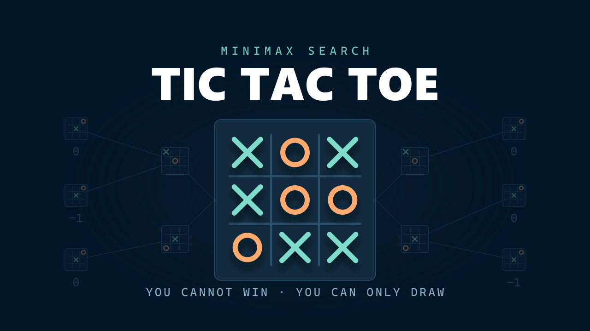

<p align="center">
  
</p>

<h1 align="center">Tic Tac Toe</h1>

<p align="center">
  <strong>The classic three-in-a-row, against a minimax opponent that cannot lose.</strong>
</p>

<p align="center">
  <a href="https://dangervalentine.github.io/javascript-minimax-tic-tac-toe/">Live Demo</a>
</p>

<p align="center">
  <a href="https://dangervalentine.github.io/javascript-minimax-tic-tac-toe/">
    
  </a>
</p>

<p align="center">
  
  
  
  
  
  
</p>

---

A tic-tac-toe board rendered as inline SVG, with a **minimax opponent** that searches six plies deep — enough, on a 3×3 board, that it never loses. Play it as X or as O, take the CPU out of the loop entirely for two-player games, and watch every state change animate — pieces spring up off the board casting their own shadows, the grid draws itself in, and the winning line strikes through.

## Features

**Opponent modes**

| Mode | Behavior |
|------|----------|
| **Hard** | Depth-6 minimax. Deep enough to see every fork and trap that matters from the opening, so the best result available to you is a draw. This is the default. |
| **Easy** | The same search capped at depth 2. It still takes an immediate win and blocks an immediate threat — it simply cannot see a fork forming two moves out, which is the gap you have to play into. |
| **2 Player** | No AI at all. Both sides are human, hot-seat on one device. |

**Play either side** &mdash; Against the CPU you choose X or O. X always moves first, so picking O means the computer opens. The search is symmetric, so it plays either side perfectly.

**Pieces with weight** &mdash; Each mark springs up with a visible overshoot, and each casts a shadow built from a second copy of its own glyph — an X casts an X, an O casts a ring. The shadow runs on its own spring and lags the piece slightly, which is what reads as depth rather than decoration.

**Win sequence** &mdash; The winning three lift and brighten while the losing marks desaturate and sink, the line draws through from one end to the other, and only then does the result land.

**Micro-interactions** &mdash; The board draws itself in on load, hovering an empty square previews your mark, the turn indicator pulses while the CPU thinks, the difficulty thumb slides between segments, and a reset sweeps the pieces away in a stagger rather than blanking the board.

**Accessibility** &mdash; `prefers-reduced-motion` is honoured globally through a single `MotionConfig`, segmented controls expose `aria-pressed` with visible focus rings, and the hover preview is gated behind `@media (hover: hover)` so it never sticks under a thumb on touch.

## How It Works

The opponent is textbook minimax — no alpha-beta pruning, no transposition table, no bitboards. A 3×3 board bounds the tree at 9! = 362,880 move orderings (far fewer once terminal positions cut branches short), so even an unoptimised search finishes in well under a frame and the interesting engineering is elsewhere.

```
cells[] ──► isTerminal() — 8 winning lines + full-board draw check
                │
                ▼
         getBestMove(board, maximizing, callback, depth)
                │
                ├── depth === max_depth or terminal? ──► score the leaf
                │        winner X (1) ──►  100 - depth   (win sooner = better)
                │        winner O (2) ──► -100 + depth   (lose later = better)
                │        draw / cutoff ──►   0
                │
                ▼
         For each empty cell:
         ├── copy the board, place this player's mark
         ├── recurse with the turn flipped and depth + 1
         └── keep the max (X to move) or min (O to move)
                │
                ▼
         At depth 0 only: nodes_map groups moves by score, and one is
         chosen at random among equals — so the CPU does not replay the
         identical game every time
```

The depth term in the leaf score is what makes it play *well* rather than merely correctly: without it, a win in one move and a win in five score the same, and the opponent stalls instead of closing out.

**Difficulty is search depth.** `max_depth` is 6 for hard and 2 for easy — the deeper search is the *falsy* difficulty value, which is worth knowing before wiring up a labelled toggle.

**Either side, one engine.** The evaluator always scores X as the maximizing player. Rather than write a second search, the AI passes `maximizing: aiPlayer === 1`, so the same code plays X or O at full strength.

The board itself is DOM, not canvas. Marks are inline `<svg>` drawn with `currentColor`, so a CSS class is all that sets their colour; the grid and the winning line are a separate SVG overlay whose `pathLength` animates from 0 to 1, which is what lets them draw themselves rather than just fade in.

```
App.jsx            owns cells[], turn, mode, humanPlayer, difficulty
   │
   ├── commit(cells) applies a finished board and records any outcome
   │     in the same state update
   │
   ├── useEffect schedules the CPU move when it is the AI's turn, and
   │     cancels the timer on cleanup — which is also the in-flight guard
   │
   └── Board.jsx
         ├── GridLines.jsx   4 lines, pathLength 0 → 1, staggered
         ├── Cell.jsx × 9    hover ghost + AnimatePresence around the mark
         │     └── Mark.jsx  inline glyph + a shadow copy on its own spring
         ├── WinLine.jsx     angle derived from the first and last piece
         └── Result.jsx      mode-aware wording
```

## Theming

Every colour resolves through [`src/theme.css`](./src/theme.css), which holds the **Night Owl** dark palette as `--nowl-*` custom properties.

Colours live in CSS and nowhere else. `motion` only ever animates `transform`, `opacity` and `filter` — never colour — so there is no second copy of the palette in JavaScript that can drift out of sync with the stylesheet. To retheme, change the tokens; nothing else hardcodes a colour.

Two assets are generated *from* the palette and need regenerating when it moves: `public/favicon.svg` (plus the `.ico` and the two PNG app icons) and `public/tic-tac-toe.png`, the README hero.

All timing is centralised the same way, in [`src/motion.js`](./src/motion.js) — every spring, duration, stagger and delay, including the CPU's think time. One edit retunes the whole feel.

## Quick Start

```bash
npm install
npm run dev        # dev server at http://localhost:5173/javascript-minimax-tic-tac-toe/
npm run build      # production bundle in ./dist
npm run preview    # serve the production bundle locally
```

Vite's `base` is set to `/javascript-minimax-tic-tac-toe/` in [`vite.config.js`](./vite.config.js) so assets resolve correctly on GitHub Pages. The same base path applies to the dev server URL &mdash; use `/javascript-minimax-tic-tac-toe/`, not `/`.

## Tech Stack

- **React 19** &mdash; owns game state; the board is DOM, not canvas
- **Vite 6** &mdash; dev server, build, GitHub Pages base path
- **Motion 12** &mdash; springs, `AnimatePresence`, and `layout` for the sliding toggles
- **Inline SVG** &mdash; marks, grid and win line, all `currentColor`
- **Minimax** &mdash; depth-limited game-tree search, depth-scored leaves
- **Night Owl** &mdash; one token file drives every colour in the app

## Project Structure

```
src/
├── App.jsx                 Game state, turn ownership, CPU scheduling
├── index.jsx               React 19 createRoot + MotionConfig entry
├── helper.js               Minimax engine + terminal detection
├── motion.js               Every spring, duration, stagger and delay
│
├── theme.css               Night Owl tokens as --nowl-* properties
├── index.css               Reset + font stack
├── App.css                 Component styles, all reading the tokens
│
├── Header.jsx              Logo, title, turn indicator, control cluster
├── SegmentedToggle.jsx     Generic segmented control with a layout thumb
├── ResetButton.jsx         Reset control with press feedback
│
├── Board.jsx               Board container, grid, cells, win line, result
├── GridLines.jsx           SVG grid overlay that draws itself in
├── Cell.jsx                One square: hover preview + mark presence
├── Mark.jsx                Inline X / O glyph + its cast-shadow copy
├── WinLine.jsx             Line struck through the winning three
└── Result.jsx              Win / draw announcement
```

## Deployment

[`.github/workflows/deploy.yml`](./.github/workflows/deploy.yml) builds and publishes to GitHub Pages on every push to `master`, using the modern `actions/deploy-pages` flow (no `gh-pages` branch).

One-time setup on the repo:

1. **Settings → Pages → Build and deployment → Source:** select **GitHub Actions**.
2. Push to `master` (or run the workflow manually from the Actions tab).

If you fork the repo, also update the `base` value in `vite.config.js` to match your repo name.
